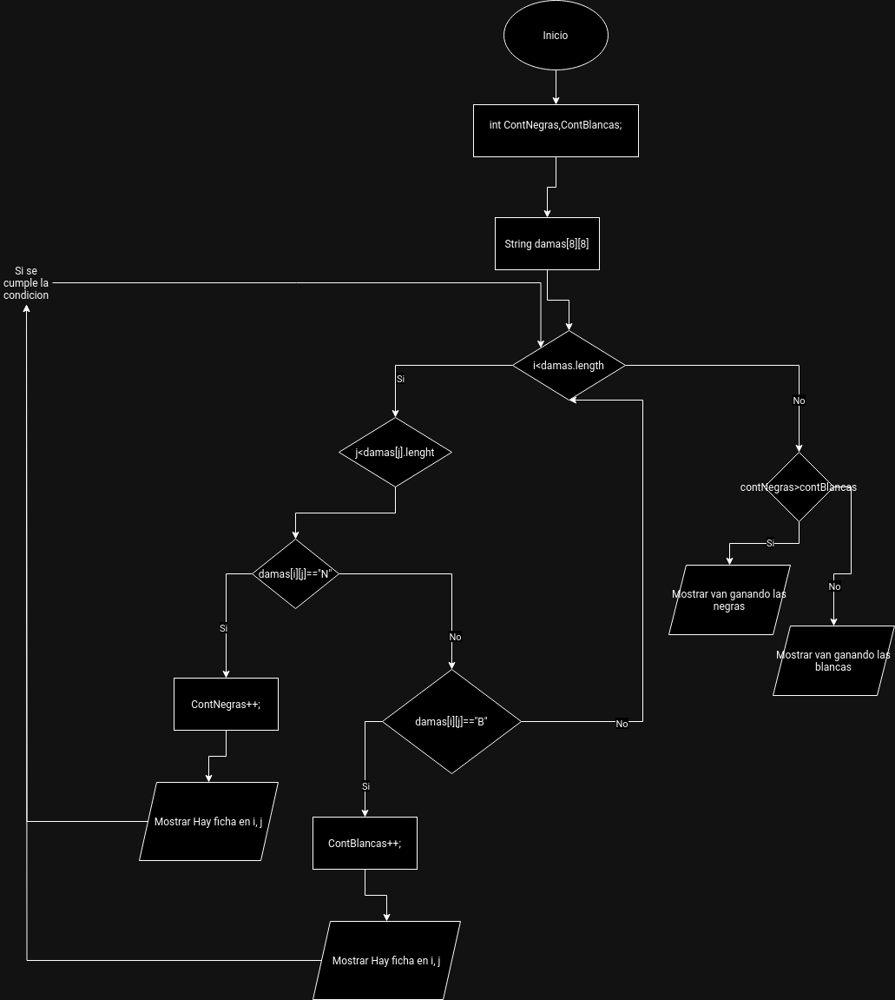

# Examen 1ª Evaluación

---

Explica a continación cada apartado del examen

Con cada apartado realiza un commit diferente

## Primer apartado

Diagrama de flujo programa para ver fichas en un tablero de damas



## Segundo apartado

El tablero es de la siguiente manera

```java
String[][] damas = {
    {null, "N", null, "N", null, "N", null, "N"},
    {"N", null, "N", null, "N", null, "N", null},
    {null, "N", null, "N", null, "N", null, "N"},
    {null, null, null, null, null, null, null, null},
    {null, null, null, null, null, null, null, null},
    {"B", null, "B", null, "B", null, "B", null},
    {null, "B", null, "B", null, "B", null, "B"},
    {"B", null, "B", null, "B", null, "B", null}
};

```

El `null` lo pongo para reflejar posicion vacia

## Tercer apartado
Las tres funciones que podrian hacer el codigo más facil de entender son:

1. Recorrer tablero de las damas: Funcion que recorra el tablero de damas
2. Mostrar jugador ganador: Comparar el numero de fichas de cada jugador
3. Mostrar fichas: Mostrar que hay fichas en determinadas posiciones
4. Averiguar ganador: Obtener si uno u otro tiene más fichas
5. Saber fichas son Blancas o Negras: Obtener el tipo de ficha
## Cuarto apartado
Aqui se especificara el javadoc de las diversas funciones

- Primera funcion: Recorrer el tablero
```java
/**
 * Recorremos el tablero para poder verificar individualmente cada casilla
 * @param tablero le pasamos el tablero de damas que queremos recorrer
 */
```
- Segunda funcion: Mostrar jugador ganador
```java
/**
 * Saber que jugador va ganando
 * @param contNegras el contador de fichas negras totales
 * @param contBlancas el contador de fichas blancas totales
 */
```
- Tercera funcion: Mostrar fichas
```java
/**
 * Mostrar que hay fichas en la posicion X Y en caso de que las haya
 * @param posicionActual la posicion actual del tablero en la que estamos
 */
```
- Cuarta funcion: Saber quien tiene más fichas
```java
/**
 * Obtener el que tiene más fichas
 * @param contNegras la cantidad de fichas negras
 * @param contBlancas la cantidad de fichas blancas
 * @return true si hay más negras que blancas sino se obtiene false
 */
```
- Quinta funcion: Saber fichas son blancas o negras
```java
/**
 * Saber si las fichas son blancas o negras
 * @param contenido le pasamos el tablero con las coordenadas a revisar
 * @return devuelve true si son negras y false si son blancas
 */
```