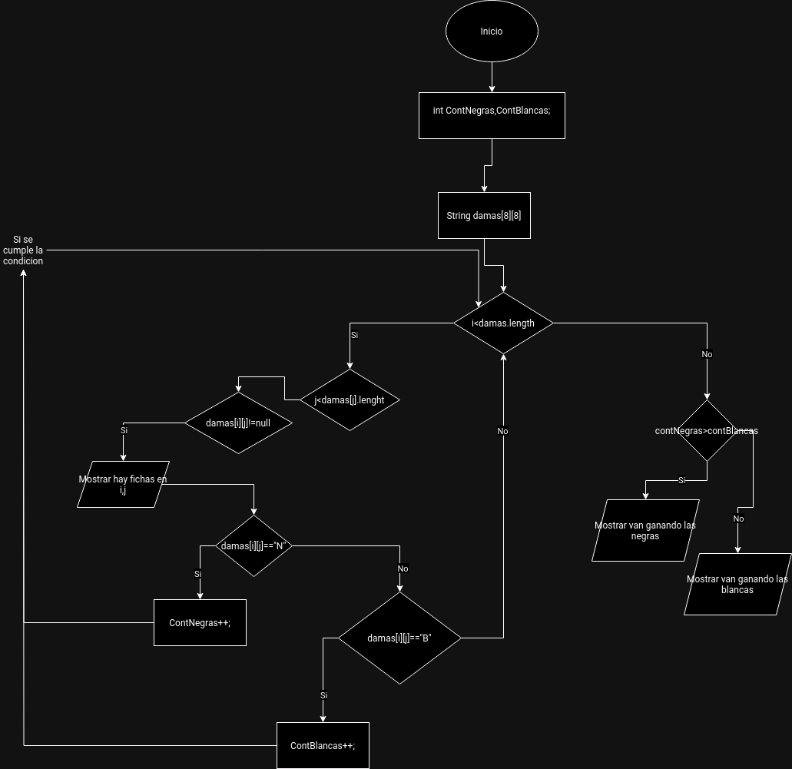

# Examen 1ª Evaluación

---

Explica a continación cada apartado del examen

Con cada apartado realiza un commit diferente

## Primer apartado

Diagrama de flujo programa para ver fichas en un tablero de damas



## Segundo apartado

El tablero es de la siguiente manera


## Tercer apartado
Las tres funciones que podrian hacer el codigo más facil de entender son:

1. 
2. Averiguar jugador ganador: Comparar el numero de fichas de cada jugador
3. Mostrar fichas: Mostrar que hay fichas en determinadas posiciones 

## Cuarto apartado
Aqui se especificara el javadoc de las diversas funciones

- Primera funcion: Averiguar tipo de ficha
```java
/**
 * Obtener tipo ficha
 * @param posicion le pasamos la posicion actual en el tablero para verificarla
 * @return blanca o negra dependiendo del tipo de ficha
 */
```
- Segunda funcion: Averiguar jugador ganador
```java
/**
 * Saber que jugador va ganando
 * @param contNegras el contador de fichas negras totales
 * @param contBlancas el contador de fichas blancas totales
 */
```
- Tercera funcion: Mostrar fichas
```java
/**
 * Mostrar que hay fichas en la posicion X Y en caso de que las haya
 * @param posicionActual la posicion actual del tablero en la que estamos
 */
```